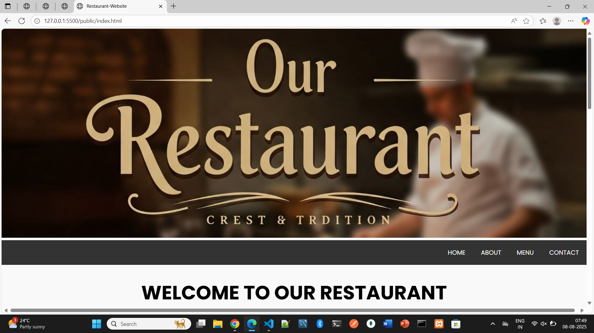
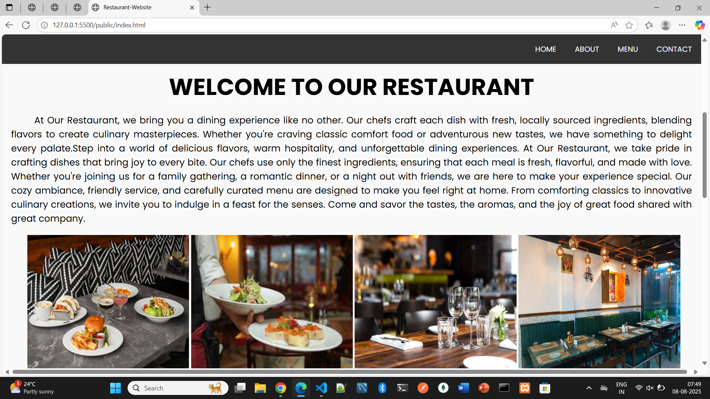
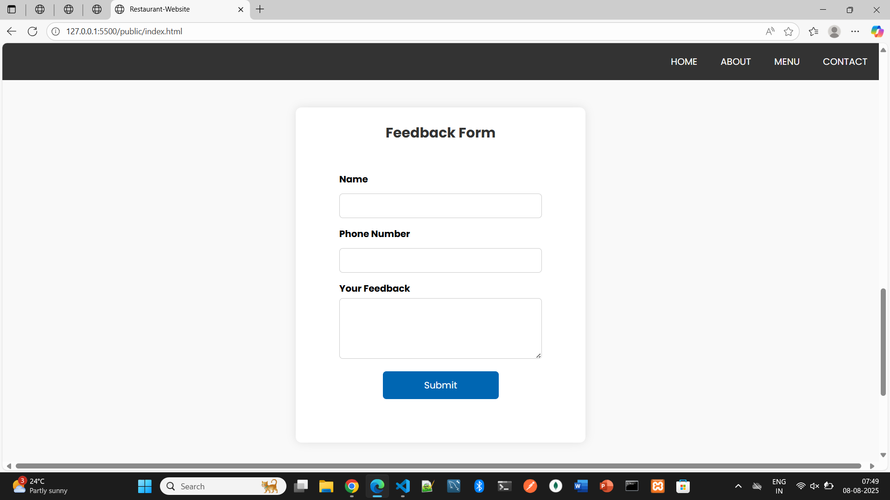
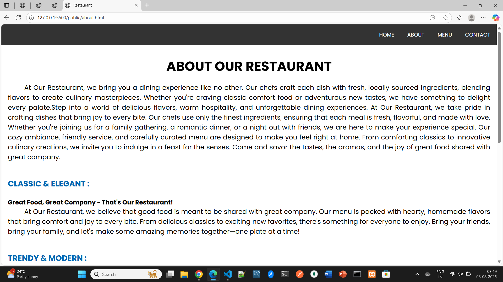
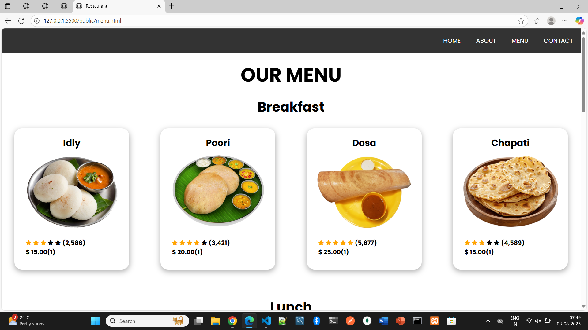
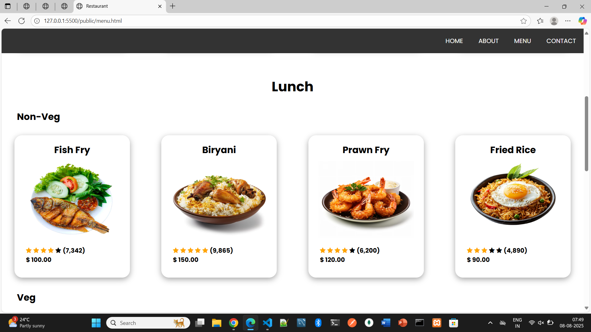
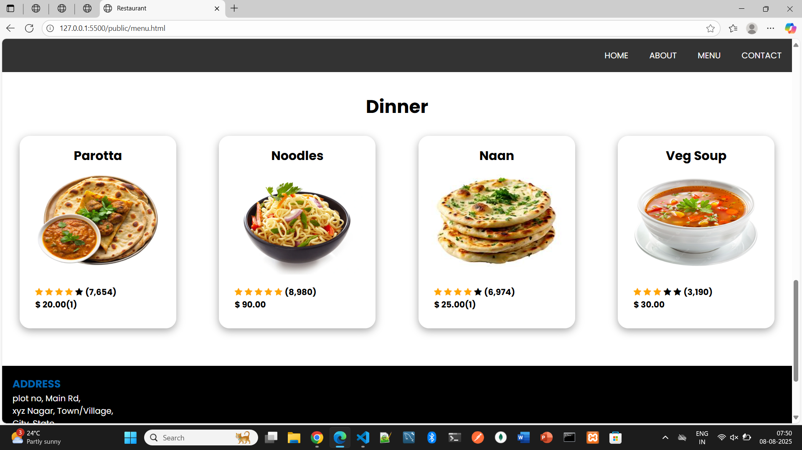
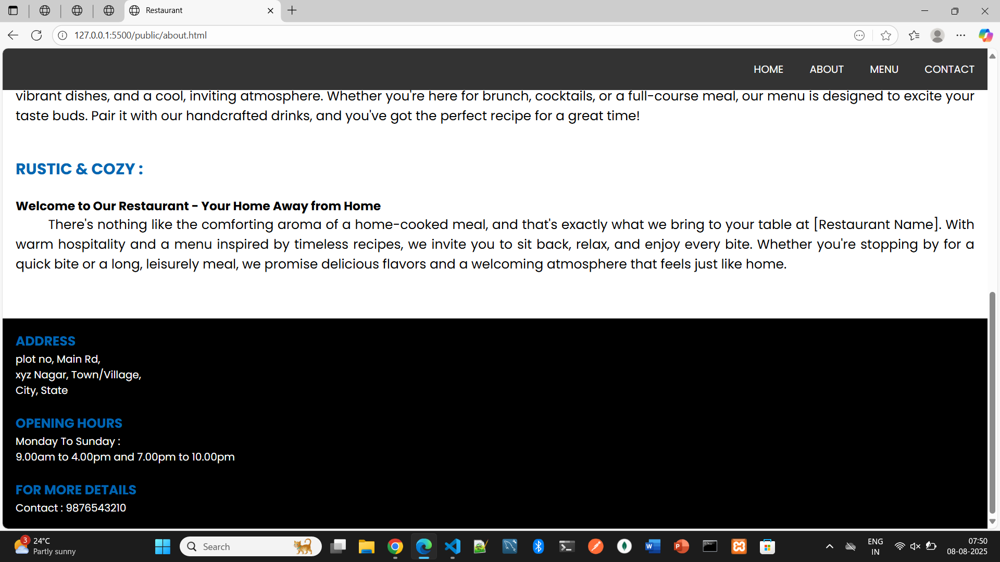

# 🍽 Restaurant Website with Feedback System

A responsive multi-page restaurant website built with **HTML, CSS, JavaScript** for the frontend and **Node.js + MySQL** for the backend feedback system.

---

## 📌 Features
- **Home Page** – Welcome message, introduction, image gallery
- **About Page** – Restaurant story and details
- **Menu Page** – List of dishes with images
- **Feedback Form** – Collects name, phone, and message, stores in MySQL
- Fully responsive layout

---

## 📸 Screenshots

### 🏠 Home Page-Header


### 🏠 Home Page-Main


### 📝 Feedback From


### ℹ️ About Page


### 🍽 Menu Page


### 🍽 Menu Page


### 🍽 Menu Page


### 📞 Contact


---


## 🛠 Tech Stack

**Frontend:**
- HTML5
- CSS3  
  - `indexstyle.css` – Home page styling  
  - `aboutstyle.css` – About page styling  
  - `menustyle.css` – Menu page styling  
- JavaScript (form submission & interactivity)

**Backend:**
- Node.js
- Express.js
- MySQL
- MySQL Workbench (for DB design)

---

## 📂 Folder Structure
```bash
restaurant-website/
│
├── server/ # Backend code
│ ├── server.js # Main server file
│ ├── package.json # Dependencies
│ ├── db/
│ │ ├── connection.js # MySQL connection setup
│ │ └── db.sql # SQL schema file
│ ├── routes/
│ │ └── feedback.js # Feedback POST route
│ └── node_modules/
│
├── public/ # Frontend files
│ ├── index.html # Home page
│ ├── about.html # About page
│ ├── menu.html # Menu page
│ ├── css/
│ │ ├── indexstyle.css # Styles for home page
│ │ ├── aboutstyle.css # Styles for about page
│ │ └── menustyle.css # Styles for menu page
│ ├── js/
│ │ └── script.js # Frontend JavaScript
│ └── images/ # All images
│
└── README.md
```

---

## ⚙️ Installation & Setup

### 1️⃣ Clone the Repository
```bash
git clone https://github.com/yourusername/restaurant-website.git
cd restaurant-website/server
```

### 2️⃣ Install Dependencies
```bash
npm install
```

### 3️⃣ Create the Database

In MySQL Workbench (or CLI):
```bash
CREATE DATABASE restaurantdb;

USE restaurantdb;

CREATE TABLE feedback (
    id INT AUTO_INCREMENT PRIMARY KEY,
    name VARCHAR(100) NOT NULL,
    phone VARCHAR(15) NOT NULL,
    message TEXT NOT NULL,
    created_at TIMESTAMP DEFAULT CURRENT_TIMESTAMP
);
```

### 4️⃣ Configure MySQL Credentials

Edit :
```bash
// server/db/connection.js
const db = mysql.createConnection({
  host: 'localhost',
  user: 'root',
  password: 'your_password',
  database: 'restaurantdb'
});
```

### 5️⃣ Start the Server
```bash
node server.js
```

### 6️⃣ Open in Browser

Visit:
```bash
http://localhost:3000
```

---

## 📄 License
This project is licensed under the MIT License - feel free to use and modify!

---

## 📞 Contact
Made with 💙 by [Jeevitha](https://github.com/jeevitha28-g)